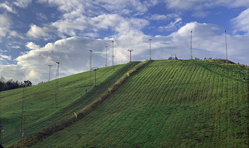

>Reda, I appreciate how you helped me in my moment of crisis when suffocating from anxiety, not knowing what the hell I was doing with the Terminal. In a crowded class you took the time to make sure I was up to date.  
For this, I thank you from the bottom of my heart. You'll be pleased to know I now use Terminal on a regular basis. I wouldn't say Terminal and I are friends yet but definitely heading in the right direction! Feel safe knowing every time I look at the terminal I think of you hahahah! Thank you for all your support and advice and support! 

- Adam

---

>Thank you Reda, for your invaluable feedback, endless patience and support. How are we going to manage without you? 🌟

- Agnes

---

>Reda, the coolest guy on the block!   
I don’t think I’ve ever had a lecturer that motivated me so much in learning more and more. You’ve made me more confident in coding and been a great inspiration during these last months.

- August

---

>Hey Reda! ✨   
First of all, I just want to say how amazing was to have you as our first industry leader. Starting to code from scratch with a totally different background was something that made me afraid of doing it. In the back of my mind, my fear was always to not be able to keep up. But with your support, always very attentive to all levels and different contexts that the class has, I was able to unleash the developer inside of me and surprise myself with my potential in the best possible way!   
 
And for that, I will always appreciate you. Thanks for all the knowledge and the friendship. You’re the best ✨🌟

    1/2

---

> <a href="https://link.tospotify.com/frq9sTF2Nbb" target="_blank">🎵🎸🎹🎻🎷</a> The best coding playlist 😂 It has been my best coding company, and who knows not yours too from now on! 😆

    2/2

- Cecilia Lobo 💛

---

>Reda, It's been a pleasure meeting and getting to know you these past months. I see you as an honest person, a good explainer, a thinker, and an excellent walking buddy! 😄 I hope this is not goodbye, and that we will stay in touch!   
🤩 Big hugs - and many many thanks for making this start of my Front end developer career so great!! 👩‍💻 🔜 🥇

- Cecilia Hallerby

---

>Reda, thank you for sharing your knowledge and guiding our coding journey!

- Emilia Manda

---

Thank you Reda for your support, patience, kindness, honesty, your ability to listen and for this fantastic start of our Hyper Island journey. You have really become a part of our crew and I will miss you! Hope you will join us at no name or at a random Windows XP hill nearby as soon as corona allows us. ⛰ Until then  - all the best!

- Elin Nordin

---

>Reda, we have been so lucky to have had you as our industry leader during these months.   
Your are a good teacher and have really made an effort to explain things to us in a comprehensive way. 
I appreciate your patience and humor and how you've taken the time to get to know us and hang out.

- Emilia Frisell

---

> Reda,   
It's been a pleasure to have you being the one to introduce us to the world of coding, and all the interesting people you brought to us! I hope you've enjoyed being our IL, I know I've enjoyed having you with us and I hope you'll come back again, at the very least stick around in Discord to watch us grow!

Take good care of yourself.

- Emma 
