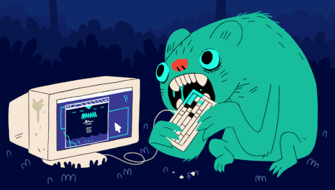

>I can not believe that we made it to the end! This is a little appreciation message to let you know just how helpful you have been. You are such an amazing industry leader and I hope you know that — you were such a huge influence on me these months, you have made me excited and passionate about the program even more. I am grateful.

Thank you, Reda. 
XOXO

- Michaela ❤️

---

>Thank you Reda, for the time & knowledge you have shared with us.  And for making me realise that I shouldn’t be intimidated rather just be challenged and inspired to only get better. 😊

- Mithila

---

Reda, thanks for always supporting us, listening to our errors and debugging with us even during all the days we felt like this guy:

- Neha

> <a href="https://link.tospotify.com/Nr4NKmEdGbb" target="_blank">🎵🎸🎹🎻🎷</a>

---
Reda,

    Thank you for not only being a good mentor
    but also a source of inspiration 
    and a good friend!
- Omid

---

> I've been enjoying all your lectures since day 1, Reda (that's something valuable coming from a real tech dummie as me). I also enjoyed your closeness and friendship attitude. I hope I can catch up on all the terminology to chat about nerd staff with you in the future. Thank you Reda!!

- Pablo

---

>Reda,   
Thank you for being a great role model and teacher, and an even better friend. I really appreciate the time you have taken to get to know us and spend the time with us. I feel inspired and motivated by you every time we get to hang out and after every lecture. I hope we can continue to talk after this module and long into the future. 

><a href="https://www.youtube.com/playlist?list=PLy_XgQYCeQlXnjTrzGY6hYoZibOdzKs5s" target="_blank">🎵🎸🎹🎻🎷</a>: The playlist I have been listening to on the Rythm bot, I update it regularly if you're ever looking for some tunes. Don't be a stranger 😊

- Paul
